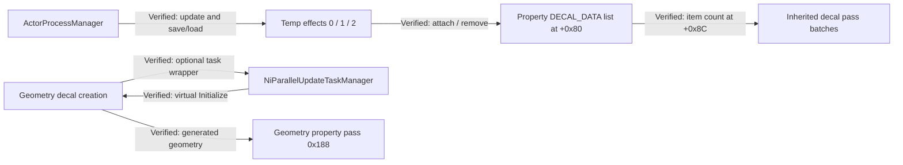

# OctoberPass: decals, temporary effects, and asynchronous creation

This pass publishes the decoded information from the open Oblivion database selected by the analyst (`0i4j`, `C:\Games\Oblivion\Oblivion.exe`). It refreshes 84 function records and their disassembly, pseudocode, prototypes, comments, instruction records, callers, callees, and references. It also adds 11 type snapshots, 10 global/vtable snapshots, and the observed relationships between these systems. The [manifest](manifest.json) identifies the source and baseline commit.

The [function inventory](function_index.md) links the 84 focused evidence anchors to their current pseudocode. [function_changes.json](function_changes.json) retains their before/after metadata. Historical folder names are retained; the root indexes identify current names. The [complete annotation snapshot](database_delta/README.md) subsequently refreshes the full root function, type, data, metadata, and graph catalogs. The focused [types](types), [data](data), and [relationships.json](relationships.json) remain the evidence bundle for the conclusions below.

[Focused export integrity checks](validation.json) record the original 84-function validation run. The complete snapshot has its [own broader validation record](database_delta/validation.json). **Verified:** all 84 focused primary-range byte hashes match the pinned baseline. Twenty-five functions also have noncontiguous IDA chunks, which this pass records separately rather than changing the historical meaning of `size` and `sha256`. Matching primary-range hashes establish agreement for those ranges, not identity of every byte in the two full databases.

Confidence applies to each interpretation, not to an entire subsystem. **Verified** means strong direct Oblivion-side evidence; **Probable** means multiple independent supporting indicators; **Candidate** means plausible but awaiting confirmation; **Unknown** means evidence is insufficient. Raw type names and unlabelled IDA annotations are snapshots, not additional verified conclusions. A function's exported confidence summarizes its existing labelled comment; qualifications and unknown fields in that comment still apply.

## Payload ownership and property linkage

| Confidence | Conclusion | Oblivion evidence |
| --- | --- | --- |
| Verified | `DECAL_DATA` occupies `0x4C` bytes. Its owned texture reference is at `+0x00`, and its owned property reference is at `+0x48`. | `DECAL_DATA_ReleaseOwnedReferences` at `0x56C0F0` decrements/releases both references; decal destructors release the payload and free its allocation. Constructors, save/load, and the [layout](types/DECAL_DATA/type.json) corroborate the offsets. |
| Verified | `+0x3C` is the target reference FormID; `+0x40` receives elapsed time divided by duration. | The predicates at `0x56C180` / `0x56D480` resolve the FormID and cast to `TESObjectREFR`; updates at `0x56BE10` / `0x56CCE0` write the ratio. |
| Verified | The property contains a pointer list at `+0x80`, with its item count at `+0x8C`. A node has next/previous links at `+0` / `+4` and payload at `+8`. | `BSShaderLightingProperty_AddDecalData` at `0x7EE3E0` allocates/links a node, stores its payload, and increments the count. [Property layout](types/BSShaderLightingPropertyLayout_t/type.json), [list layout](types/NiTPointerList_DecalDataLayout_t/type.json), and [node layout](types/NiTPointerListNode_DECAL_DATA_t/type.json). |
| Verified | Addition and removal invalidate cached render-pass state at property `+0x24`. Removal unlinks the node without releasing the payload's owned references. | Writes at `0x7EE41A` / `0x7EE7AF`; removal at `0x7EE740` calls the list helper at `0x776690`. Payload release remains visible in the effect/property destructors. |
| Verified | Property `+0x90` is used as the removal traversal cursor. | `0x7EE755` through `0x7EE794` update it while comparing payload identity. |
| Unknown | The meanings of payload `+0x04`, the vector at `+0x2C`, the float at `+0x38`, and byte `+0x44` remain unresolved. | The layout preserves their storage without assigning a stronger interpretation. |

The two effect layouts are separate from the shared payload: [BSTempEffectDecalLayout_t](types/BSTempEffectDecalLayout_t/type.json) is `0x1C` bytes; [BSTempEffectGeometryDecalLayout_t](types/BSTempEffectGeometryDecalLayout_t/type.json) is `0x54` bytes. **Verified:** both carry the payload at `+0x18`; the geometry effect additionally uses generated geometry at `+0x1C` and a failure byte at `+0x28`. Its update at `0x56CCE0` expires immediately on that failure flag. **Candidate:** the `projectionPoint`, `orientationVector`, `footprintScale`, and `randomRotation` member names describe possible roles of the scalar groups consumed by the geometry builder. **Unknown:** their complete coordinate-space and parameter contracts are not established by this export alone.

## Creation, update, and serialization

**Verified:** registration at `0x678D30` retains the effect and routes type IDs `4..6` to manager `+0x48`; other IDs use manager `+0x40`. The loop at `0x67ACA0` calls virtual `Update` at `+0x50`, removes effects returning false, and releases references. Cell cleanup at `0x67A8C0` supplies the corresponding unload path. These are fields of the shared `ActorProcessManager` object; its name does not imply one manager object per actor.

| Confidence | Type ID | Established role | Evidence |
| --- | --- | --- | --- |
| Verified | `0` | `BSTempEffectDecal` | [Vtable `0xA6822C`](data/A6822C/vtable.json) points at the shared zero-return stub for `GetTypeID`; load case 0 allocates `0x1C` and calls `0x56BDE0`. |
| Verified | `1` | `BSTempEffectGeometryDecal` | [Vtable `0xA6851C`](data/A6851C/vtable.json) uses `ReturnLiteral1` at `+0x54`; load case 1 allocates `0x54` and calls `0x56CDE0`. |
| Verified | `2` | `BSTempEffectParticle` | [Vtable `0xA686CC`](data/A686CC/vtable.json) uses `0x8CF6B0`; load case 2 allocates `0x20` and calls `0x570700`. |
| Verified | `3` | Base `BSTempEffect` ID | [Base vtable `0xA681AC`](data/A681AC/vtable.json) uses `ReturnLiteral3` at `+0x54` and the shared false-returning leaf at `+0x58`. It therefore fails the saveability filter. |
| Unknown | `4` | Producer and restore role unresolved | Registration accepts it into the extended list, but `0x679850` has no restoration case for it. No class identity is inferred. |
| Verified | `5`, `6` | `MagicModelHitEffect`, `MagicShaderHitEffect` restore cases | The switch at `0x679850` selects their constructors and allocations, then dispatches virtual `LoadGame` at `+0x64`. |

**Verified:** save at `0x679630` filters through `IsSaveable` (`+0x58`), writes the type byte from `GetTypeID` (`+0x54`), and calls `SaveGame` (`+0x60`). Load at `0x679850` reads a 16-bit count and byte tags, constructs the selected class, and retains successfully restored objects in the appropriate list. [Portable decoded IDs](types/OctoberPassEnums.h) preserve these values, including the unresolved tag 4.

**Verified:** type-0 saveability at `0x56C180` requires a payload. A resolved `TESObjectREFR` must have loaded 3D; an unresolved reference succeeds only if the stored FormID is zero. Type-1 saveability at `0x56D480` additionally requires generated geometry and always requires a resolved reference with loaded 3D. There is no type-1 success bypass for an unresolved zero ID. This states the actual predicates without assuming that every possible FormID lookup table necessarily lacks key zero.

**Verified:** leaf functions are shared across unrelated vtables. `0x91FEA0` returns 1 for geometry-effect type dispatch and for SpeedTree property contexts. `0x73FD50` returns 3; `0x69D990` is a shared false-returning leaf despite its `TESForm::IsActor` symbol. A leaf's name alone does not identify the owning class.

## Asynchronous geometry creation

| Confidence | Conclusion | Evidence |
| --- | --- | --- |
| Verified | The byte at `0xB3A690` selects an attempt to queue a creation task. Failed acquisition/submission falls through to synchronous effect `Initialize`. | `BSTempEffectGeometryDecal_StartOrQueueCreateTask`, `0x56CD60`. |
| Verified | `BSTECreateTask` is a `0x10`-byte wrapper with a retained controller at `+0x0C`. Submission uses manager virtual `+0x4C` with mode 1. | [Wrapper layout](types/BSTECreateTask_Layout_t/type.json), constructor/destructor, setter helper `0x478300`, and call at `0x56CD8E`. |
| Verified | Task vtable `+0x4C` runs the wrapped virtual `+0x4C`; task vtable `+0x54` releases any remaining controller and returns the task to its pool. | [Vtable `0xA6813C`](data/A6813C/vtable.json), Run `0x56B8D0`, ReturnToPool `0x56BB50`, pool helpers `0x56B920` through `0x56BB90`. |
| Verified | With fallback byte `0xB3F944` set, Run skips both the wrapped invocation and its local release. The final ReturnToPool path performs the remaining release. | Branch at `0x56B8DA`, local release at `0x56B8F6`, and ReturnToPool release at `0x56BB5F`. |
| Verified | The wait helper sets that fallback byte on a semaphore timeout or the checked pending-count boundary, then waits indefinitely. | `0x404D60`, particularly `0x404D99` through `0x404DC1`. [Global reference snapshots](data). |
| Unknown | Initialization/writers and runtime policy of the async-creation gate remain unresolved. | A gate read does not establish its configuration source. |

## Shader pass relationships

**Verified:** inherited decal batching and the geometry-decal property's own pass are distinct paths. `BSShaderPPLightingProperty_BuildInheritedLightPasses` passes the property `+0x8C` item count at `0x85B9ED` to `0x85A200`. That helper appends passes while subtracting `OB_ShaderPassControl_010201A0.decalPassBatchSize`. The Lighting30 builder at `0x8637D0` uses the same batch-size field with its own selector pair. The control block and its typed field are captured at [data `0xB42E84`](data/B42E84/item.json) and in its [layout](types/OB_ShaderPassControl_010201A0_t/type.json).

| Confidence | Selector | Exact resolver string | Verified producer/limit |
| --- | --- | --- | --- |
| Verified | `0x152` / `0x153` | `BSSM_3XDECAL` / `BSSM_3XDECAL_A` | Lighting30 construction at `0x864301` / `0x864337`. |
| Verified | `0x188` | `BSSM_GEOMDECAL` | GeometryDecalShaderProperty vtable `+0x5C`, function `0x864830`, construction at `0x8648AD`. |
| Verified | `0x189` | `BSSM_GEOMDECAL_S` | Resolver mapping at `0x7B67BC`; its producer is **Unknown** within this pass. |
| Verified | `0x18A` / `0x18B` | `BSSM_DECAL` / `BSSM_DECAL_A` | Batched helper construction at `0x85A281` / `0x85A30C`. |

All names above are checked against `BSShaderProperty_GetRenderPassName` at `0x7B4920`. **Unknown:** the downstream semantic contract of the forwarded `passByte` remains unresolved. The caller initializes it to 1; the batching helper forwards it without interpreting it.



## Fallout comparison and limits

The [reference evidence](fallout_reference/manifest.json) comes from the still-open Fallout PPC database (`d4jo`). It contains six function anchors and three type snapshots. It is a different executable/build and architecture from the Oblivion x86 database; addresses, layouts, and selector values are not transplanted.

**Verified divergence:** Oblivion's property stores and manages the list at `+0x80` shown above. The Fallout reference `BSShaderLightingProperty` is `0x7C` bytes and has a different member layout. `ExtraDataList::GetDecalRefs` at `0x822748B0` queries extra-data type `0x57`; its [ExtraDecalRefs](fallout_reference/types/ExtraDecalRefs/type.json) is separate from the Oblivion payload/list arrangement.

**Verified divergence:** the captured Fallout [BGSDecalManager](fallout_reference/types/BGSDecalManager/type.json) contains separate pending simple-decal and emitter lists, and `UpdateDecals` at `0x822E8288` calls their two update routines. The Oblivion manager routing/update chain is established independently at `0x678D30` / `0x67ACA0`. **Unknown:** feature-level one-to-one equivalence between these collections and Oblivion's temp-effect lists.

**Verified divergence:** Fallout's geometry-decal property builder at `0x828CECC8` emits `0x1FF` for skinned geometry or `0x1FE` otherwise, while the Oblivion builder emits `0x188`. Fallout's accumulator at `0x8222D8B0` renders geometry groups 2 and 3. **Candidate:** these are useful neighboring-system anchors when researching Oblivion rendering; they do not establish identical algorithms or a direct function homology. **Unknown:** a direct Fallout counterpart for Oblivion's pooled `BSTECreateTask` path.

## Corrections and reproduction

**Verified correction:** the old instruction comment at `0x679900` described particle restoration while attached to type 0. It now identifies the `0x1C` type-0 decal allocation/default initializer and points to the separate type-2 case at `0x679982` / `0x6799A0`. The save predicates and task fallback cleanup comments were also made branch-specific, and the literal-1 leaf comment now documents shared vtable use. These corrections were written into the live Oblivion IDA and included in this export.

The update-loop comment at `0x67ACA0` now names `ActorProcessManager` instead of describing the loop as "per-actor." This removes an ambiguous ownership implication while preserving the directly observed list/update/release behavior. Only that function and its matching records were refreshed for this wording correction; its primary and chunk hashes are unchanged.

Some decompiler expressions retain older aliases or imprecise propagated types (for example, the node-removal call can still display `sub_776690` and a `BSTextureManager *` cast). **Unknown:** those aliases are not class-identification evidence. Use the actual call target, exported prototype, instructions, layout, and xrefs together; the report's list interpretation is grounded in those concrete operations.

Reproduce the selected refresh against the same open databases from the repository root:

```powershell
python scripts/export_analysis_pass.py --repository . --targets Findings/OctoberPass/targets.json
```

The script verifies executable identities and reads bounded targets. It preserves the original function schema, including primary-range `size` and `sha256`, and adds `total_chunk_size` / `chunks_sha256` for noncontiguous IDA tails. It exports actual numeric xref types and retains previous metadata from the pinned baseline commit. It uses no database open/close, shutdown, restart, or save operation. For metadata-only changes to the exporter, `--reuse-pseudocode --skip-reference` retains this pass's already validated decompilation/reference output while refreshing metadata.
